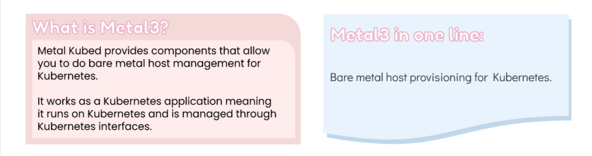
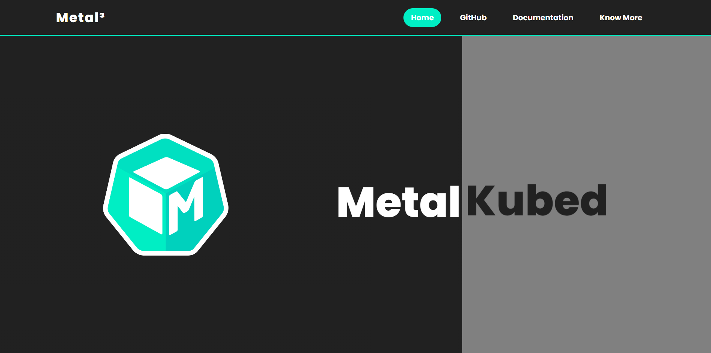
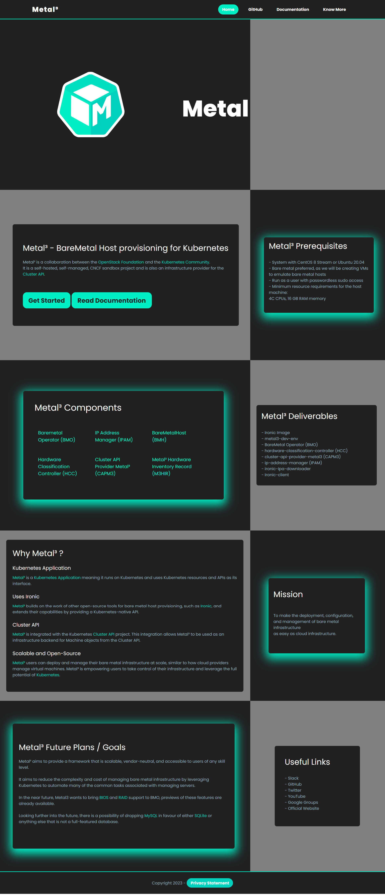
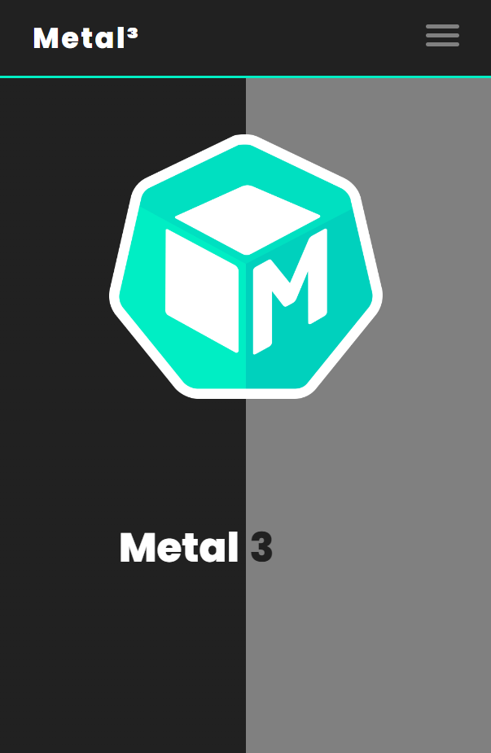
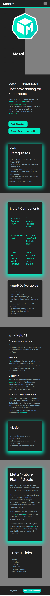

# Guidelines for the Mentors

- I have updates the design of the website to give it a more professional look and feel.
-  | 
- <video src="./assets/before.webm"></video>
- <video src="./assets/after.webm"></video>
- I have made the website fully responsive.
- Screenshots can be found at the end of this README.md file.
- For best viewing experience, view on `Google Chrome` with `100%` zoom.

<br>

# Metal<sup>3</sup>: Metal Kubed

<p align="center">

</p>

### Description

Metal3 is a BareMetal host provisioning service for Kubernetes.
<br>
It is a self-hosted, self-managed, CNCF sandbox project and is also an infrastructure provider for the Cluster API.
<br>
(K8S SIG life-cycle)

# What is Metal<sup>3</sup>?

<p align="center">

</p>

### Get Started with Metal Kubed

[Get Started](https://metal3.io/try-it.html)

### Check Out the User Guide

[User Guide](https://book.metal3.io/introduction.html)

# Metal<sup>3</sup> Components

| S.No. | Name                        |
| ----- | --------------------------- |
| 1     | BareMetal Operator          |
| 2     | cluster-api-provider-metal3 |
| 3     | Ironic Image                |

See more about Metal<sup>3</sup> Components [here](https://metal3.io/documentation.html).

# FAQs

<details><summary>Why Metal³.io?</summary>

```
There are a number of great open source tools for bare metal host provisioning, including Ironic. Metal3.io aims to build on these technologies to provide a Kubernetes native API for managing bare metal hosts via a provisioning stack that is also running on Kubernetes.

We believe that Kubernetes Native Infrastructure, or managing your infrastructure just like your applications, is a powerful next step in the evolution of infrastructure management.

The Metal3.io project is also building integration with the Kubernetes cluster-api project, allowing Metal3.io to be used as an infrastructure backend for Machine objects from the Cluster API.
```

</details>

<details><summary>What are the pre-requisites of Metal³?</summary>

```
- System with CentOS 8 Stream or Ubuntu 20.04
- Bare metal preferred, as we will be creating VMs to emulate bare metal hosts
- Run as a user with passwordless sudo access
- Minimum resource requirements for the host machine: 4C CPUs, 16 GB RAM memory
```

</details>

<details><summary>What are Metal³'s deliverables?</summary>

```
- baremetal-operator (BMO)
- cluster-api-provider-metal3 (CAPM3)
- ironic-image
- ip-address-manager (IPAM)
- hardware-classification-controller
- ironic-ipa-downloader
- metal3-dev-env
- Ironic-client
```

</details>

<details><summary>What are the future plans of Metal³?</summary>

```
There is a lot of work planned in Metal3. In the near future, Metal3 wants to bring BIOS and RAID support to BMO, previews of these features are already available.
Looking further into the future, there is a possibility of dropping MySQL in favour of either SQLite or anything else that is not a full-featured database.
```

</details>

<details><summary>What is an operator?</summary>

```
An Operator is a method of packaging, deploying and managing a Kubernetes application.
A Kubernetes application is an application that is both deployed on Kubernetes and managed using the Kubernetes APIs and kubectl tooling. You can think of Operators as the runtime that manages this type of application on Kubernetes.
```

</details>

<details><summary>What is the baremetal operator?</summary>

```
It’s the operator in charge of definitions of physical hosts, containing information about how to reach the Out of Band management controller, URL of image to provision, plus other properties related with hosts being used for provisioning instances.
```

</details>

<details><summary>What is IPMI?</summary>

```
IPMI is the acronym for Intelligent Platform Management Interface which is used to monitor hardware health (fans, voltage, temperature, etc).
It was created by a joint effort by several manufactures. It allows to also define boot order and power status of the hardware.
```

</details>

<details><summary>What is out-of-band management controller?</summary>

```
Enterprise hardware usually have an integrated or optional controller that allows to reach the server even if it’s powered down, either via dedicated or shared nic.
This controller allows some checks on the server hardware and also perform some settings like changing power status, changing Boot Order, etc.
The Baremetal Operator uses it to power on, reboot and provision the physical servers to be used for running workloads on top.
```

</details>

# Other Links

[Official Website](https://metal3.io/)
<br>

[Official Documentation](https://metal3.io/documentation.html)
<br>

[GitHub Repository](https://github.com/metal3-io)
<br>

[Slack](https://kubernetes.slack.com/messages/CHD49TLE7)
<br>

[Twitter](https://twitter.com/metal3_io)
<br>

[YouTube](https://www.youtube.com/channel/UC_xneeYbo-Dl4g-U78xW15g/videos)

# Screenshots

## Desktop View

<p align="center">
<p>Hero Section</p>

<p>Full Page</p>

</p>

## Mobile View

<p align="center">
<p>Hero Section</p>

<p>Full Page</p>

</p>
